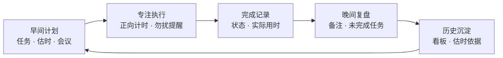
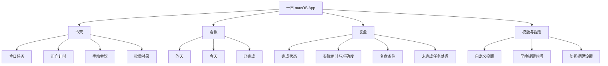
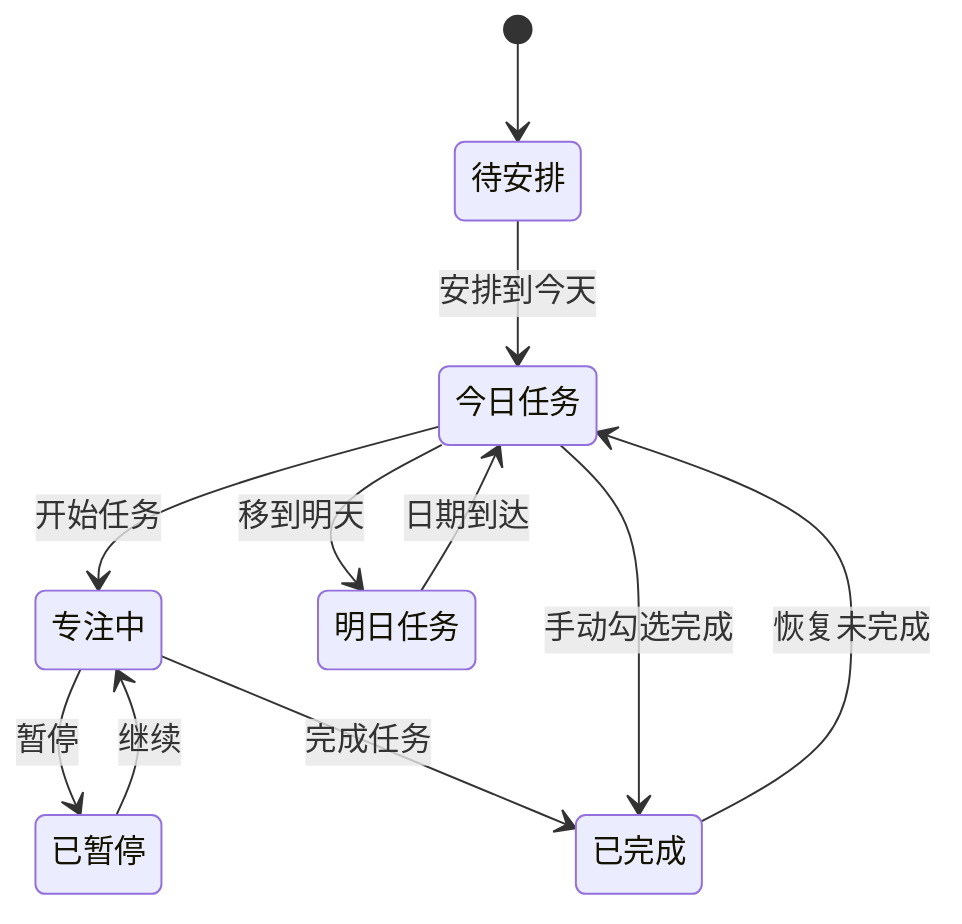
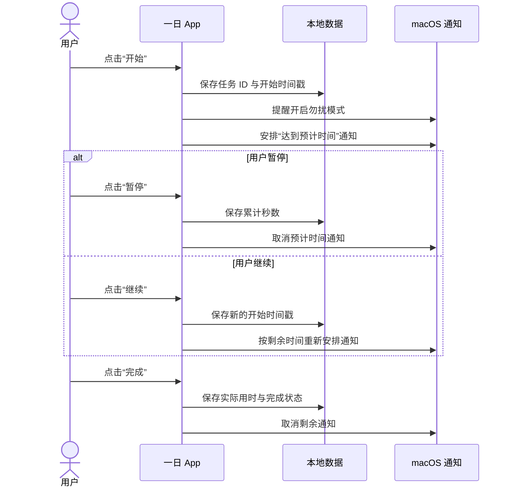
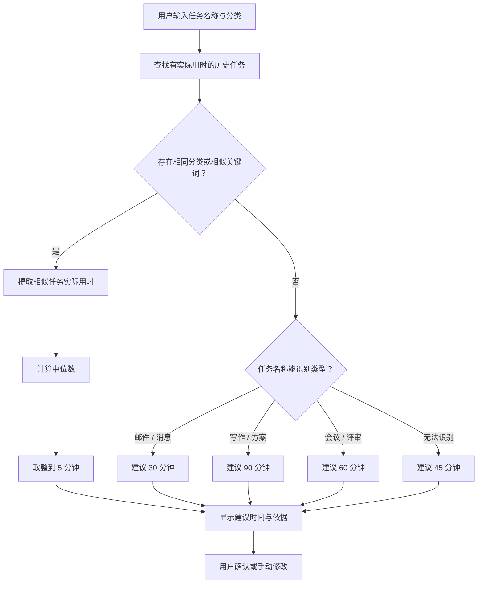
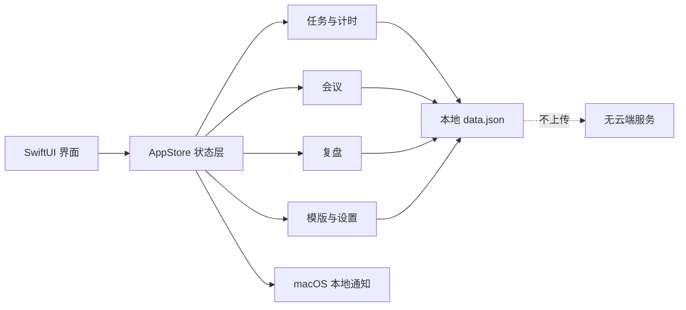

# 「一日」产品说明文档

| 项目 | 内容 |
| --- | --- |
| 产品名称 | 一日 |
| 当前版本 | 0.1.0 MVP |
| 产品形态 | macOS 桌面应用 |
| 当前阶段 | 个人试用版 |
| 文档日期 | 2026-08-05 |
| 数据策略 | 本地优先，不上传云端 |

## 1. 产品概述

「一日」是一款面向个人工作的每日任务规划、专注计时和晚间复盘工具。

产品希望把一天的工作闭环放在同一个应用中：早上规划任务和会议，工作时记录任务实际用时，晚上确认完成情况并复盘，之后通过看板和历史数据观察自己的工作节奏。

它不追求复杂的团队协作，而是帮助用户回答四个问题：

1. 今天要做什么？
2. 每件事预计需要多久？
3. 实际花了多久、是否完成？
4. 明天应该如何调整？

### 产品闭环

## 2. 目标用户与使用场景

### 2.1 目标用户

- 主要使用 Mac 工作的个人用户。
- 每天需要处理多个任务、会议和深度工作时段。
- 希望记录预计用时与实际用时，但不想维护复杂项目管理系统。
- 希望数据留在本机，不依赖账号或网络服务。

### 2.2 核心场景

- 开始工作时，收到提醒并列出今日任务、预计用时和会议。
- 选择一个任务开始工作，应用进行正向计时并提醒开启勿扰模式。
- 达到预计时间时收到提示，自主选择继续或完成。
- 晚上收到复盘提醒，确认完成状态、填写备注并处理未完成任务。
- 使用模版或批量补录，为连续多个日期快速创建每日任务。
- 根据历史实际用时获得自动估时建议。

## 3. 产品目标与边界

### 3.1 当前目标

- 建立完整的“计划—执行—复盘—回顾”个人工作闭环。
- 降低每日重复录入任务的成本。
- 通过实际用时改善用户的估时能力。
- 在应用重启或 Mac 休眠后保持数据和计时准确。

### 3.2 当前不包含

- 团队成员、任务指派、评论或审批。
- Google Calendar、Outlook、Apple Calendar 等外部日历同步。
- 多设备同步、账号系统或云端备份。
- 自动切换 macOS 专注模式；当前只提醒用户手动开启勿扰模式。
- Windows、iPhone、iPad 和 Android 客户端。

## 4. 信息架构

应用使用四个一级页面：

| 页面 | 主要职责 |
| --- | --- |
| 今天 | 查看今日任务和会议，添加任务，开始专注计时，批量补录 |
| 看板 | 按“昨天、今天、已完成”查看和调整任务 |
| 复盘 | 确认完成状态、查看估时准确度、填写复盘和处理未完成任务 |
| 模版 | 管理任务模版、提醒时间、通知权限和默认处理策略 |

### 页面与功能结构

## 5. 核心用户流程

### 5.1 每日开始

1. 默认在 10:30 发送“开始今天的计划”系统通知。
2. 用户进入“今天”页面；侧边栏显示当天日期，标题根据早晨、白天或晚上展示对应问候。
3. 用户添加任务，并填写或自动生成预计用时。
4. 用户手动添加当天会议。
5. 应用展示今日任务数量、已完成数量和预计总用时。

### 5.2 专注执行

1. 用户在任务右侧点击“开始”。
2. 应用记录任务开始时间，并开始正向计时。
3. 如果已开启相应设置，系统提醒用户开启勿扰模式。
4. 用户可以暂停、继续或完成任务。
5. 暂停期间不计时；继续后按剩余预计时间重新安排提醒。
6. 达到预计时间时发送系统通知，但不会自动停止计时。
7. 完成任务后记录实际用时和完成时间。

### 任务与计时状态

### 5.3 晚间复盘

1. 默认在 20:00 发送“该做今日复盘了”系统通知。
2. 用户确认每项任务是否完成。
3. 用户查看今日完成数量、实际专注时长和估时准确度。
4. 用户填写当天复盘备注。
5. 应用按照设置处理未完成任务。

### 5.4 批量补录

1. 用户在“今天”页面点击“批量补录”。
2. 选择开始日期、结束日期和任务模版。
3. 选择需要补录的具体任务。
4. 可选择跳过已有同名任务的日期。
5. 应用预览日期数量和最多新增任务数量。
6. 用户确认后一次性创建任务。

## 6. 功能说明

### 6.1 任务管理

每个任务包含以下数据：

| 字段 | 说明 |
| --- | --- |
| 名称 | 必填，用于识别任务和匹配历史任务 |
| 分类 | 深度工作、日常、写作、规划、复盘或自定义 |
| 预计用时 | 最少 5 分钟，可手动修改或使用自动估时 |
| 安排日期 | 可安排到某一天，也可放入“待安排” |
| 完成状态 | 未完成或已完成 |
| 实际用时 | 由专注计时产生 |
| 完成时间 | 标记完成时记录 |
| 备注 | 数据模型已预留；任务级备注编辑界面计划在 0.2 版本加入 |

支持的任务操作：

- 添加任务。
- 通过右键菜单编辑任务名称、分类、日期和预计用时。
- 标记完成或恢复未完成。
- 开始专注计时。
- 移到今天、明天或待安排。
- 删除任务。

### 6.2 会议

- 用户可以手动录入会议名称、开始时间、时长和地点或会议链接。
- “今天”页面按时间顺序展示当日会议。
- 用户可以通过右键菜单编辑或删除会议。
- 当前不连接外部日历，也不自动识别会议冲突。

### 6.3 正向计时

- 同一时间只允许一个活动任务。
- 计时基于开始时间戳和累计秒数计算，不依赖界面定时器连续运行。
- 应用重启或 Mac 休眠后，正在运行的计时仍能按实际经过时间恢复。
- 暂停后保存累计时间并取消预计时间提醒。
- 继续后根据剩余预计时间重新安排提醒。
- 完成后将累计时间写入任务实际用时。

### 计时与系统提醒时序

### 6.4 看板

| 分组 | 规则 |
| --- | --- |
| 昨天 | 安排在昨天且仍未完成的任务 |
| 今天 | 安排到今天且未完成的任务 |
| 已完成 | 最近完成的任务，当前最多展示 20 条 |

看板支持调整任务日期、标记完成和删除任务。

### 6.5 未完成任务处理

用户可以选择以下策略：

| 策略 | 行为 |
| --- | --- |
| 逐项决定 | 默认；复盘后保持原状，由用户逐个处理 |
| 自动移到明天 | 完成复盘时，将当天未完成任务统一移到明天 |
| 保留在待安排 | 完成复盘时，清除当天未完成任务的安排日期 |

### 6.6 自定义模版

- 系统预置“工作日启动”和“无会专注日”模版。
- 用户可以创建、编辑和删除自定义模版。
- 模版包含名称、说明、任务列表和默认预计用时。
- 应用模版时，用户仍可以选择只创建其中部分任务。
- 系统内置模版可编辑但不可删除。

### 6.7 自动估时

自动估时以“建议”形式提供，不会阻止用户手动修改。

估时规则：

1. 从有实际用时的历史任务中查找相同分类或包含相似关键词的任务。
2. 使用相似任务实际用时的中位数，减少极端值影响。
3. 将结果取整到 5 分钟。
4. 如果没有足够历史记录，根据任务名称中的类型关键词提供初始建议。
5. 界面说明建议依据，例如“基于 6 次相似任务的中位用时”。

当前关键词回退规则：

| 任务类型 | 默认建议 |
| --- | --- |
| 邮件、消息、回复 | 30 分钟 |
| 写作、方案、报告 | 90 分钟 |
| 会议、评审、沟通 | 60 分钟 |
| 无法识别 | 45 分钟 |

后续可以加入更细的个人模型，但第一阶段不需要把任务内容发送给外部 AI 服务。

### 自动估时决策流程

### 6.8 提醒与通知

| 提醒 | 默认时间或触发方式 | 可配置 |
| --- | --- | --- |
| 开始今日计划 | 每日 10:30 | 是 |
| 晚间复盘 | 每日 20:00 | 是 |
| 开启勿扰模式 | 开始任务时 | 可开关 |
| 达到预计时间 | 任务累计用时达到预计值 | 自动 |

首次保存提醒设置时，应用向 macOS 请求通知权限。用户拒绝授权后，其他任务和复盘功能仍可正常使用。

### 6.9 本地数据

- 所有数据保存在 `~/Library/Application Support/YiRi/data.json`。
- 写入操作使用原子替换，降低保存过程中数据损坏的概率。
- 当前不上传数据，不需要登录账号。
- 当前不包含应用内备份、导入和导出功能。

### 本地数据架构

## 7. 当前实现状态

| 功能 | 状态 | 备注 |
| --- | --- | --- |
| 今日任务与完成状态 | 已实现 | 本地持久化 |
| 侧边栏日期与分时问候 | 已实现 | 每分钟检查时间变化 |
| 手动会议 | 已实现 | 支持右键编辑和删除 |
| 正向计时 | 已实现 | 支持暂停、继续和完成 |
| 勿扰提醒 | 已实现 | 不自动切换专注模式 |
| 达到预计时间提醒 | 已实现 | 系统本地通知 |
| 任务看板 | 已实现 | 三列看板 |
| 晚间复盘 | 已实现 | 支持每日总体备注 |
| 未完成任务策略 | 已实现 | 默认逐项决定 |
| 自定义模版 | 已实现 | 支持创建、编辑和删除 |
| 批量补录 | 已实现 | 单次最多 92 天 |
| 自动估时 | 已实现 | 历史中位数加规则回退 |
| 自定义提醒 | 已实现 | 默认 10:30 / 20:00 |
| 任务级备注 | 计划中 | 建议进入 0.2 版本 |
| 数据备份与导出 | 计划中 | 建议进入 0.2 版本 |
| 外部日历同步 | 暂不规划 | 根据实际需求再评估 |

## 8. MVP 验收标准

### 8.1 任务与计时

- 用户能够创建任务并在应用重启后继续看到该任务。
- 用户能够通过自动估时获得建议，并能覆盖建议值。
- 正向计时支持开始、暂停、继续和完成。
- 任务完成后能够看到实际用时。
- 休眠或退出应用不会让正在运行的计时归零。

### 8.2 复盘与看板

- 今日任务能正确出现在“今天”看板列。
- 昨天未完成的任务能出现在“昨天”。
- 已完成任务能进入“已完成”。
- 保存复盘后，备注在重新打开页面时仍然存在。
- 三种未完成任务策略均产生对应结果。

### 8.3 模版与批量补录

- 用户能够创建包含多个任务的自定义模版。
- 用户能够选择日期范围和模版进行批量补录。
- 开启“跳过重复”后，不在同一天创建同名任务。
- 无效日期范围或未选择任务时不能确认补录。

### 8.4 通知

- 用户授权后，系统能够按设置的早晚时间发送通知。
- 修改提醒时间后，旧通知被替换而不是重复存在。
- 暂停任务后取消预计时间提醒，继续后重新安排。

## 9. 隐私与安全

- 默认本地存储，不收集用户身份信息。
- 不发送任务标题、复盘内容或时间记录到网络服务。
- 通知权限由 macOS 管理，用户可以随时在系统设置中关闭。
- 当前试用版本使用本地临时签名，适合个人使用；正式分发需要开发者签名和 Apple 公证。

## 10. 后续版本建议

### 0.2：完善个人使用闭环

- 任务级备注和完成时快速备注。
- 编辑、删除会议。
- 任务搜索、日期筛选和标签筛选。
- JSON 或 CSV 备份、导入和导出。
- 自动估时历史依据详情与手动纠偏。
- 通知权限状态和发送测试通知。

### 0.3：效率与洞察

- 周复盘和月度统计。
- 预计用时与实际用时趋势。
- 按分类统计时间投入。
- 菜单栏快速开始、暂停和完成任务。
- 全局快捷键与开机启动。

### 后续评估

- Apple Calendar 只读同步。
- iCloud 多设备同步。
- iPhone 快速记录和提醒。
- 可选的本地智能分类与更个性化估时模型。

## 11. 技术交付说明

- 技术栈：SwiftUI、Foundation、UserNotifications。
- 最低系统版本：macOS 13。
- 当前构建架构：Apple Silicon（arm64）。
- 当前应用版本：0.1.0。
- 构建产物：`dist/一日.app`。
- 构建命令：`./scripts/build-app.sh`。
