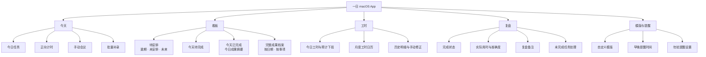
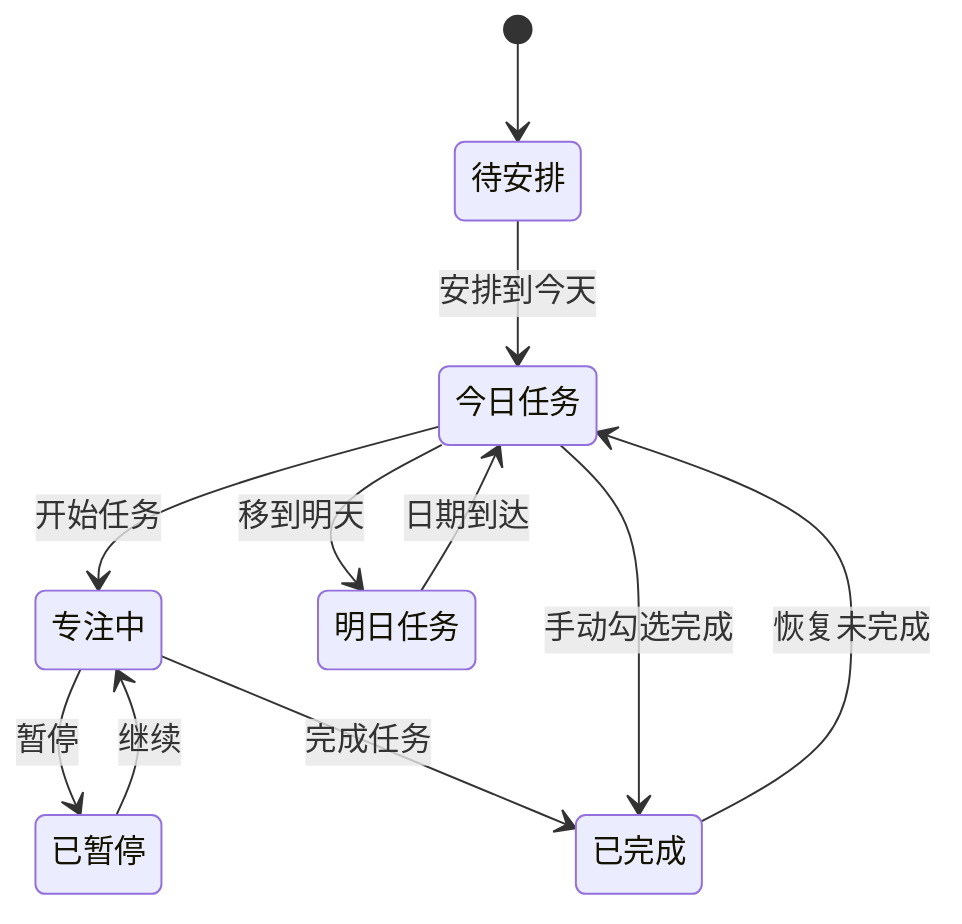
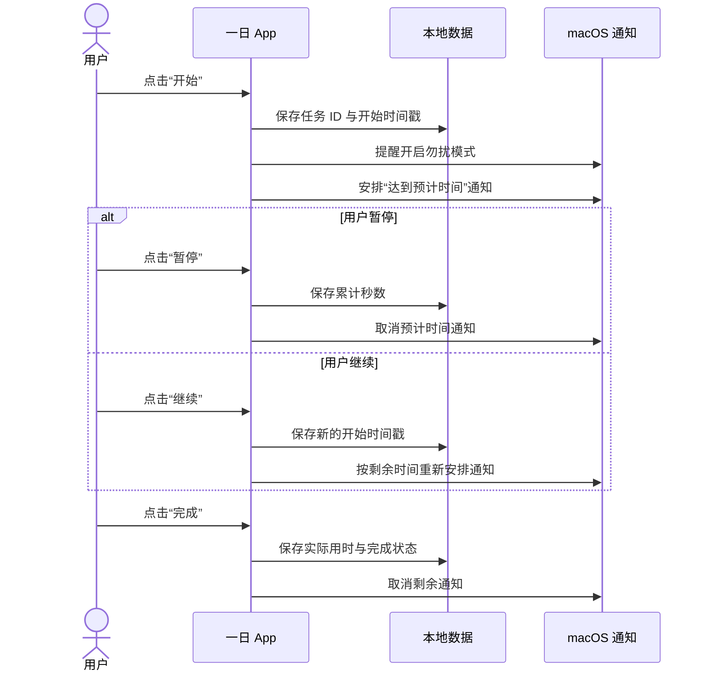
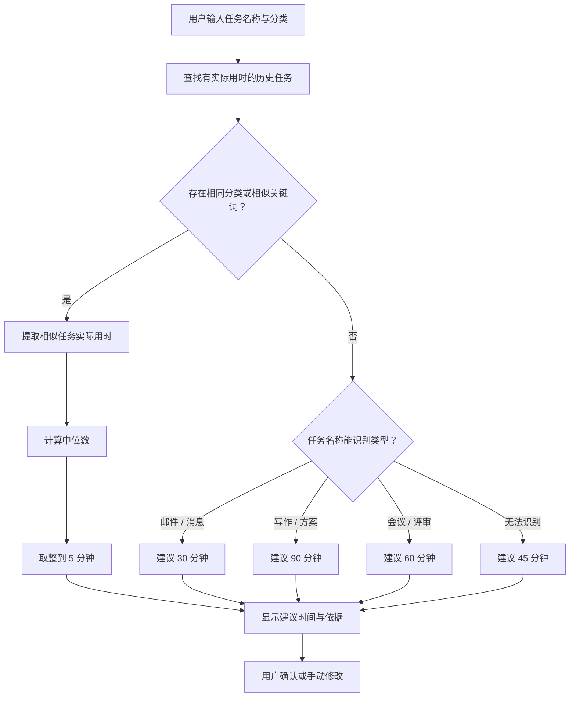
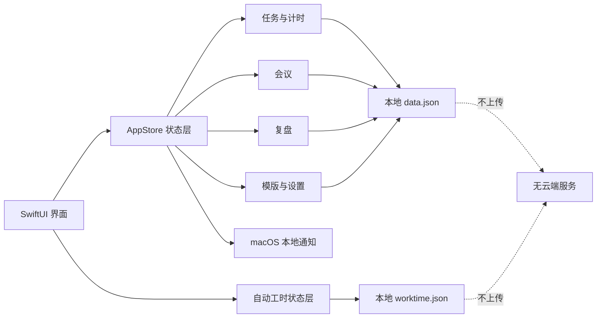

# 「一日」产品说明文档

| 项目 | 内容 |
| --- | --- |
| 产品名称 | 一日 |
| 当前版本 | 0.2.1 MVP |
| 产品形态 | macOS 桌面应用 |
| 当前阶段 | 个人试用版 |
| 文档日期 | 2026-08-26 |
| 数据策略 | 本地优先，不上传云端 |

## 1. 产品概述

「一日」是一款面向个人工作的每日任务规划、自动工时、专注计时和晚间复盘工具。

产品希望把一天的工作闭环放在同一个应用中：早上规划任务和会议，工作时记录任务实际用时，晚上确认完成情况并复盘，之后通过看板和历史数据观察自己的工作节奏。

它不追求复杂的团队协作，而是帮助用户回答四个问题：

1. 今天要做什么？
2. 每件事预计需要多久？
3. 实际花了多久、是否完成？
4. 明天应该如何调整？

### 产品闭环

## 2. 目标用户与使用场景

### 2.1 目标用户

- 主要使用 Mac 工作的个人用户。
- 每天需要处理多个任务、会议和深度工作时段。
- 希望记录预计用时与实际用时，但不想维护复杂项目管理系统。
- 希望数据留在本机，不依赖账号或网络服务。
- 首次启动时设置自己的称呼，之后可从侧边栏再次修改。

### 2.2 核心场景

- 开始工作时，收到提醒并列出今日任务、预计用时和会议。
- 选择一个任务开始工作，应用进行正向计时并提醒开启勿扰模式。
- 达到预计时间时收到提示，自主选择继续或完成。
- 晚上收到复盘提醒，确认完成状态、填写备注并处理未完成任务。
- 使用模版或批量补录，为连续多个日期快速创建每日任务。
- 一次安排未来连续多个工作日的重复事项，到对应日期自动进入今日待办。
- 根据历史实际用时获得自动估时建议。
- 从日期或长期事项两个维度回顾全部已完成成果。

## 3. 产品目标与边界

### 3.1 当前目标

- 建立完整的“计划—执行—复盘—回顾”个人工作闭环。
- 降低每日重复录入任务的成本。
- 通过实际用时改善用户的估时能力。
- 在应用重启或 Mac 休眠后保持数据和计时准确。

### 3.2 当前不包含

- 团队成员、任务指派、评论或审批。
- Google Calendar、Outlook、Apple Calendar 等外部日历同步。
- 多设备同步、账号系统或云端备份。
- 自动切换 macOS 专注模式；当前只提醒用户手动开启勿扰模式。
- Windows、iPhone、iPad 和 Android 客户端。

## 4. 信息架构

应用使用五个一级页面：

| 页面 | 主要职责 |
| --- | --- |
| 今天 | 查看今日任务和会议，添加任务，开始专注计时，批量补录 |
| 看板 | 按“待安排、今天待完成、今天已完成”查看任务，支持卡片跨列拖放与完整成果档案 |
| 工时 | 自动记录每天最早与最晚活动，通过月历看板查看、结束和修正工时 |
| 复盘 | 确认完成状态、查看估时准确度、填写复盘和处理未完成任务 |
| 模版 | 管理任务模版、提醒时间、通知权限和默认处理策略 |

### 页面与功能结构

## 5. 核心用户流程

### 5.1 每日开始

1. 默认在 10:30 发送“开始今天的计划”系统通知。
2. 用户进入“今天”页面；侧边栏显示当天日期，标题根据早晨、白天或晚上展示对应问候。
3. 用户添加任务，并填写或自动生成预计用时。
4. 用户手动添加当天会议。
5. 应用展示今日任务数量、已完成数量和预计总用时。

### 5.2 专注执行

1. 用户在任务右侧点击“开始”。
2. 应用记录任务开始时间，并开始正向计时。
3. 如果已开启相应设置，系统提醒用户开启勿扰模式。
4. 用户可以暂停、继续或完成任务。
5. 暂停期间不计时；继续后按剩余预计时间重新安排提醒。
6. 达到预计时间时发送系统通知，但不会自动停止计时。
7. 完成任务后记录实际用时和完成时间。

### 任务与计时状态

### 5.3 晚间复盘

1. 默认在 20:00 发送“该做今日复盘了”系统通知。
2. 用户确认每项任务是否完成。
3. 用户查看今日完成数量、实际专注时长和估时准确度。
4. 用户填写当天复盘备注。
5. 用户点击“完成今日复盘”后，应用再次确认这是不可逆的日终封存操作。
6. 确认后，应用结束仍在运行的计时，按照设置处理未完成任务，并保存当天复盘。
7. 保存成功后展示完成反馈弹窗，根据当天完成情况给予鼓励，并回顾完成任务数与专注时长。
8. 关闭反馈后，“今天”和“复盘”切换为不含任务列表与编辑入口的日终鼓励页；第二天自动恢复正常界面。

### 5.4 批量补录

1. 用户在“今天”页面点击“批量补录”。
2. 选择开始日期、结束日期和任务模版。
3. 选择需要补录的具体任务。
4. 可选择跳过已有同名任务的日期。
5. 应用预览日期数量和最多新增任务数量。
6. 用户确认后一次性创建任务。

## 6. 功能说明

### 6.1 任务管理

每个任务包含以下数据：

| 字段 | 说明 |
| --- | --- |
| 名称 | 必填，用于识别任务和匹配历史任务 |
| 分类 | 深度工作、日常、写作、规划、复盘或自定义 |
| 预计用时 | 最少 5 分钟，可手动修改或使用自动估时 |
| 安排日期 | 可安排到某一天，也可放入“待安排” |
| 完成状态 | 未完成或已完成 |
| 实际用时 | 由专注计时产生 |
| 完成时间 | 标记完成时记录 |
| 备注 | 数据模型已预留；任务级备注编辑界面计划在 0.2 版本加入 |

支持的任务操作：

- 添加任务。
- 通过右键菜单编辑任务名称、分类、日期和预计用时。
- 标记完成或恢复未完成。
- 开始专注计时。
- 移到今天、明天或待安排。
- 删除任务。

### 6.2 会议

- 用户可以手动录入会议名称、开始时间、时长和地点或会议链接。
- “今天”页面按时间顺序展示当日会议。
- 用户可以通过右键菜单编辑或删除会议。
- 当前不连接外部日历，也不自动识别会议冲突。

### 6.3 正向计时

- 同一时间只允许一个活动任务。
- 计时基于开始时间戳和累计秒数计算，不依赖界面定时器连续运行。
- 应用重启或 Mac 休眠后，正在运行的计时仍能按实际经过时间恢复。
- 暂停后保存累计时间并取消预计时间提醒。
- 继续后根据剩余预计时间重新安排提醒。
- 完成后将累计时间写入任务实际用时。

### 计时与系统提醒时序

### 6.4 未来工作日计划

新建任务提供“单日”和“连续工作日”两种安排方式；编辑已有任务时仍只修改当前任务。

- 单日模式保留日期选择。确认按钮根据所选日期显示“加入今天”“安排到明天”或“创建未来任务”。
- 连续工作日模式默认从下一个周一至周五的工作日开始，默认创建 5 天，可调整为 1–92 个工作日。
- 周六和周日不计入工作日，当前不处理中国法定节假日和调休。
- 创建前展示首日、末日与实际创建数量；默认跳过同一日期的同名任务。
- 确认后立即写入多条相互独立、带未来日期的任务。应用无需在后台运行，目标日期到来后任务会自然进入“今天待完成”。
- 编辑或完成其中一天不会批量影响其他日期。

### 6.5 看板与成果档案

| 分组 | 规则 |
| --- | --- |
| 待安排 | 除今天以外的全部未完成任务，包含逾期、未设置日期和未来日期 |
| 今天待完成 | 安排到今天且未完成的任务 |
| 今天已完成 | `completedAt` 为今天的全部任务，包含今天完成的逾期任务 |

三列中的每项任务都是独立卡片，可拖到其他列。拖到“待安排”会恢复为未完成并清除安排日期；已经位于左列的逾期、未安排或未来任务保留原日期。拖到“今天待完成”会恢复为未完成并安排到今天；拖到“今天已完成”会写入当前完成时间。同列重复拖放不会改写日期或完成时间，拖放目标在悬停时使用边框和背景高亮。

“今天已完成”顶部展示今日完成数量和实际专注时长。完成卡片使用勾选徽章、浅绿色边框、完成时间和实际用时，无计时数据时显示“手动完成”，并支持编辑、删除和恢复为未完成。任务移入该列时使用短暂淡入、缩放和勾选高光，不使用强动效。

更早完成项不在看板列内折叠展开。“查看全部成果”作为看板页头的独立按钮，与“新建任务”并列，不占用任务列空间。按钮打开独立、可滚动的成果档案，且包含今天完成的任务。成果档案根据当前屏幕可用区域扩展为接近全屏的大页面，日期与事项卡片采用自适应多列布局。顶部提供“按日期 / 按事项”切换，并在本次打开期间保留当前选择。

按日期视图以本地完成日期倒序分组，今天置顶。每日展示完成数量、累计实际专注时长和手动完成数量；任务展示完成时刻、实际用时或“手动完成”。缺少 `completedAt` 的旧数据归入底部“较早记录”。

按事项视图在本机根据任务名称自动归组，每张事项卡展示完成次数、累计实际用时、首次与最近完成日期。事项默认收起，展开后以时间线倒序展示每次完成记录；未计时记录不计入累计时长，并单独统计手动完成次数。

自动归组先统一大小写、全半角、空格和标点，再综合标题完全一致、有效公共前缀、词元重合率和中英文字符相似度；分类相同本身不构成归组依据。全部算法采用固定阈值，不调用网络或外部 AI。事项名称优先取有效公共前缀或公共词元，无法提取时使用组内较短且较新的任务名称。

事项菜单允许“重命名事项、移入其他事项、拆成新事项、合并事项”。人工修正仅锁定被操作的历史记录，不修改原任务标题，也不会成为未来任务的自动学习规则。恢复未完成后保留人工分组信息；删除任务会同步移除对应成果记录。

看板不再设置单独的底部任务区域。逾期、未安排与未来任务全部集中在左侧“待安排”列，确保任何未完成任务都有唯一且直接可见的看板入口。整个页面支持纵向滚动；未完成任务可编辑、调整日期、标记完成和删除。

### 6.6 自动工时

自动工时为可选功能，默认由用户主动开启。开启后，应用使用 macOS 原生 CoreGraphics 活动间隔接口定时检测，不读取或保存具体按键、鼠标坐标、窗口标题或应用内容。

- 默认每 1 分钟检测一次，可选 1、2、5 或 10 分钟，不允许低于 1 分钟。
- 每日工时等于“最晚活动时间 − 最早活动时间”，午休、会议和中间离开都包含在工时中。
- 凌晨工作日分界默认为 06:00，可调整为 04:00 或 05:00；分界前活动归入前一工作日。
- 每日目标工时默认 8 小时，可按 30 分钟步长设置为 1–16 小时。
- 记录当天第一次活动后，以“最早活动时间 + 目标工时”计算预计下班时间；目标到达时发送一次 macOS 本地通知。
- 修改目标工时后，当天预计下班时间与待发送提醒立即重算；手动结束或封存当天后取消提醒。
- 今天页突出展示上班时间、当日工时、预计下班时间与目标进度；最新活动仅作为辅助小字显示。
- 独立“工时”页提供月度看板；每个日期展示上班时间、下班时间、当日工时与目标进度，本月顶部汇总记录天数、累计工时、日均工时和达标天数。
- 月历支持切换月份和回到本月；点击有记录的日期可进入手动修正，页面下方保留近期明细。
- 用户可手动“结束今天”；结束后停止自动更新，在完成复盘前可继续记录。
- 完成今日复盘时同步结束当天工时；封存后当天不再允许继续记录或修正。
- 工时数据保存在独立的 `~/Library/Application Support/YiRi/worktime.json`，不改写任务的专注时长。
- 可选使用 `SMAppService` 注册登录自启动；应用需先安装到 Applications 目录。

### 6.7 未完成任务处理

用户可以选择以下策略：

| 策略 | 行为 |
| --- | --- |
| 逐项决定 | 默认；复盘后保持原状，由用户逐个处理 |
| 自动移到明天 | 完成复盘时，将当天未完成任务统一移到明天 |
| 保留在待安排 | 完成复盘时，清除当天未完成任务的安排日期 |

### 6.8 自定义模版

- 系统预置“工作日启动”和“无会专注日”模版。
- 用户可以创建、编辑和删除自定义模版。
- 模版包含名称、说明、任务列表和默认预计用时。
- 应用模版时，用户仍可以选择只创建其中部分任务。
- 系统内置模版可编辑但不可删除。

### 6.9 自动估时

自动估时以“建议”形式提供，不会阻止用户手动修改。

估时规则：

1. 从有实际用时的历史任务中查找相同分类或包含相似关键词的任务。
2. 使用相似任务实际用时的中位数，减少极端值影响。
3. 将结果取整到 5 分钟。
4. 如果没有足够历史记录，根据任务名称中的类型关键词提供初始建议。
5. 界面说明建议依据，例如“基于 6 次相似任务的中位用时”。

当前关键词回退规则：

| 任务类型 | 默认建议 |
| --- | --- |
| 邮件、消息、回复 | 30 分钟 |
| 写作、方案、报告 | 90 分钟 |
| 会议、评审、沟通 | 60 分钟 |
| 无法识别 | 45 分钟 |

后续可以加入更细的个人模型，但第一阶段不需要把任务内容发送给外部 AI 服务。

### 自动估时决策流程

### 6.10 提醒与通知

| 提醒 | 默认时间或触发方式 | 可配置 |
| --- | --- | --- |
| 开始今日计划 | 每日 10:30 | 是 |
| 晚间复盘 | 每日 20:00 | 是 |
| 开启勿扰模式 | 开始任务时 | 可开关 |
| 达到预计时间 | 任务累计用时达到预计值 | 自动 |
| 达到目标工时 | 首次活动时间加每日目标工时 | 目标时长可配置 |

首次保存提醒设置时，应用向 macOS 请求通知权限。用户拒绝授权后，其他任务和复盘功能仍可正常使用。

### 6.11 本地数据

- 任务、会议、复盘与模版保存在 `~/Library/Application Support/YiRi/data.json`，工时保存在同目录的 `worktime.json`。
- 写入操作使用原子替换，降低保存过程中数据损坏的概率。
- 读取失败时先将原文件备份为 `data-corrupt-<时间戳>.json`，再创建空白数据并向用户提示。
- 保存失败时显示错误，不再静默忽略。
- 当前不上传数据，不需要登录账号。
- 当前不包含应用内备份、导入和导出功能。

### 本地数据架构

## 7. 当前实现状态

| 功能 | 状态 | 备注 |
| --- | --- | --- |
| 今日任务与完成状态 | 已实现 | 本地持久化 |
| 侧边栏日期与分时问候 | 已实现 | 每分钟检查时间变化 |
| 手动会议 | 已实现 | 支持右键编辑和删除 |
| 正向计时 | 已实现 | 支持暂停、继续和完成 |
| 自动工时 | 已实现 | 最晚活动减最早活动，默认 1 分钟检测 |
| 月度工时看板 | 已实现 | 日历展示每日上下班、工时、进度及月度汇总 |
| 工时历史与修正 | 已实现 | 近期明细、日期点击修正与 `worktime.json` |
| 预计下班提醒 | 已实现 | 首次活动加自定义目标，修改目标后自动重排 |
| 登录自启动 | 已实现 | 基于 macOS `SMAppService` |
| 勿扰提醒 | 已实现 | 不自动切换专注模式 |
| 达到预计时间提醒 | 已实现 | 系统本地通知 |
| 任务看板 | 已实现 | 待安排、今天待完成与今天已完成三列看板 |
| 看板卡片拖放 | 已实现 | 跨列同步更新安排日期和完成状态 |
| 已完成成果墙 | 已实现 | 今日摘要、恢复未完成与轻动效 |
| 未来工作日计划 | 已实现 | 连续 1–92 个工作日，跳过周末与同日同名任务 |
| 完整成果档案 | 已实现 | 包含今天，支持按日期与按事项浏览 |
| 相似事项归组 | 已实现 | 本机确定性计算，支持重命名、移动、拆分与合并 |
| 逾期、待安排与未来任务入口 | 已实现 | 统一进入看板左侧“待安排”列 |
| 晚间复盘 | 已实现 | 支持每日总体备注 |
| 复盘完成反馈 | 已实现 | 动态鼓励语、完成任务数与专注时长 |
| 日终封存 | 已实现 | 二次确认、不可覆盖、今天与复盘切换为鼓励页 |
| 未完成任务策略 | 已实现 | 默认逐项决定 |
| 自定义模版 | 已实现 | 支持创建、编辑和删除 |
| 批量补录 | 已实现 | 单次最多 92 天 |
| 自动估时 | 已实现 | 历史中位数加规则回退 |
| 自定义提醒 | 已实现 | 默认 10:30 / 20:00 |
| 数据损坏备份与提示 | 已实现 | 原文件保留在本地数据目录 |
| 任务级备注 | 计划中 | 建议进入 0.2 版本 |
| 数据备份与导出 | 计划中 | 建议进入 0.2 版本 |
| 外部日历同步 | 暂不规划 | 根据实际需求再评估 |

## 8. MVP 验收标准

### 8.1 任务与计时

- 用户能够创建任务并在应用重启后继续看到该任务。
- 用户能够通过自动估时获得建议，并能覆盖建议值。
- 正向计时支持开始、暂停、继续和完成。
- 任务完成后能够看到实际用时。
- 休眠或退出应用不会让正在运行的计时归零。
- 用户可创建 1–92 个连续未来工作日任务，周末会被跳过。
- 未来任务在创建当天不进入今日待办，到目标日期后自动出现。
- 开启“跳过重复”后，同一日期不会创建同名任务。

### 8.2 自动工时

- 自动工时默认不开启，用户主动开启后才开始采集活动时间。
- 检测间隔默认为 1 分钟，任何设置都不低于 1 分钟。
- 同一工作日的工时严格按最晚活动减最早活动计算，不扣除午休与空闲时间。
- 06:00 分界时，凌晨活动归入前一工作日；更换分界设置后新记录按新规则归属。
- 手动结束后后续活动不得覆盖结束时间；在复盘封存前可选择继续记录。
- 修正历史起止时间后应立即持久化，结束时间不得早于开始时间。
- 每日目标支持 30 分钟粒度；预计下班时间严格等于最早活动时间加目标工时。
- 月历中每天展示的上下班时间和工时与原始记录一致，本月汇总只统计当前显示月份。
- 修改目标后，当天进度和预计下班时间立即更新，旧提醒被替换而不是重复存在。
- 达到目标时进度显示完成态；超过目标的工时仍显示真实数值而不是截断。
- 完成今日复盘后当天工时同步封存，不再显示继续或修正入口。
- 关闭自动工时后不继续采集，已有历史记录保留。

### 8.3 复盘与看板

- 今日任务能正确出现在“今天待完成”看板列。
- 逾期、未设置日期和未来任务都能出现在“待安排”。
- 今天完成的任务能进入“今天已完成”。
- 逾期任务在今天完成后计入今日成果，摘要数量与实际专注时长立即更新。
- 无计时数据的完成卡片显示“手动完成”，不显示“0 分钟”。
- 看板页头始终显示独立的“查看全部成果”按钮；点击后能够查看包含今天在内的全部完成记录。
- 新建任务时，任务名称输入框默认获得焦点，输入空格时光标正常移动，不丢失已输入内容。
- 按日期视图汇总每日完成数、实际专注时长和手动完成数，旧数据归入“较早记录”。
- 按事项视图按相似标题归组，分类相同但标题不相似的任务不会误归组。
- 重命名、移动、拆分和合并事项后结果在应用重启后仍然保留，且不会影响未来自动归组。
- 任务卡片可在三列之间拖放，安排日期、完成状态和完成时间同步更新。
- 卡片拖回同一列时，不重复改写日期或完成时间。
- 完成任务可恢复为未完成，并立即回到对应的未完成看板分组。
- 完成复盘前必须二次确认，取消后仍可继续编辑。
- 确认封存后，当天复盘不能被覆盖，“今天”和“复盘”不再展示任务列表或编辑入口。
- 封存只改变当天页面状态，不删除任务、会议和成果档案数据；新的一天自动解锁。
- 成果档案以接近全屏的大尺寸页面打开，并能根据可用宽度展示多列内容。
- 三种未完成任务策略均产生对应结果。

### 8.4 模版与批量补录

- 用户能够创建包含多个任务的自定义模版。
- 用户能够选择日期范围和模版进行批量补录。
- 开启“跳过重复”后，不在同一天创建同名任务。
- 无效日期范围或未选择任务时不能确认补录。

### 8.5 通知

- 用户授权后，系统能够按设置的早晚时间发送通知。
- 修改提醒时间后，旧通知被替换而不是重复存在。
- 暂停任务后取消预计时间提醒，继续后重新安排。
- 自动工时开始后安排目标工时提醒，修改目标时重排，结束当天时取消。

## 9. 隐私与安全

- 默认本地存储，不收集用户身份信息。
- 不发送任务标题、复盘内容或时间记录到网络服务。
- 自动工时只读取距上次输入的时间间隔，不保存按键内容、鼠标位置、应用名称或窗口标题。
- 通知权限由 macOS 管理，用户可以随时在系统设置中关闭。
- 当前试用版本使用本地临时签名，适合个人使用；正式分发需要开发者签名和 Apple 公证。

## 10. 后续版本建议

### 0.2.x：完善个人使用闭环

- 任务级备注和完成时快速备注。
- 编辑、删除会议。
- 任务搜索、日期筛选和标签筛选。
- JSON 或 CSV 备份、导入和导出。
- 自动估时历史依据详情与手动纠偏。
- 通知权限状态和发送测试通知。

### 0.3：效率与洞察

- 周复盘和月度统计。
- 预计用时与实际用时趋势。
- 按分类统计时间投入。
- 菜单栏快速开始、暂停和完成任务。
- 全局快捷键与菜单栏工时快速操作。

### 后续评估

- Apple Calendar 只读同步。
- iCloud 多设备同步。
- iPhone 快速记录和提醒。
- 可选的本地智能分类与更个性化估时模型。

## 11. 技术交付说明

- 技术栈：SwiftUI、Foundation、CoreGraphics、ServiceManagement、UserNotifications。
- 最低系统版本：macOS 13。
- 当前构建架构：Apple Silicon（arm64）。
- 当前应用版本：0.2.1（构建 9）。
- 构建产物：`dist/一日.app`。
- 构建命令：`./scripts/build-app.sh`。
- 回归测试：`./scripts/run-tests.sh`。
